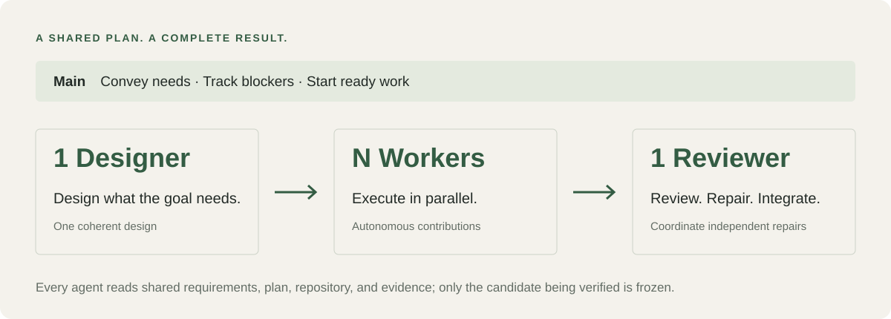

# Better Plan

**Keep long-running agent work aligned with what you asked for.**

Better Plan gives your coding agents a shared plan they can understand, update, and
carry across sessions. One Designer shapes the work, Workers make progress in
parallel, and one independent Reviewer repairs and brings the result together.



**[Explore the workflow](docs/guide.md#how-it-works)** ·
**[Get the interactive presentation](docs/presentations/better-plan-workflow.html)**

The presentation is a standalone HTML file: download it and open it in your browser.
It shows the workflow and the actual role prompts, with no setup or internet required.

## Why use it?

- **Keep the goal in view.** Requirements, decisions, and results live in a shared
  plan instead of being repeatedly reinterpreted in handoffs.
- **Make useful work parallel.** Workers read the same context and use their own
  judgment. Real dependencies determine what can run together.
- **Finish with an independent view.** The Reviewer checks the result—and the
  plan itself—against your needs, repairs problems, and integrates the work.

Use it for multi-part features, migrations, and projects that span many sessions.
Small tasks can stay small.

## Start using it

Requires Python 3.8+. Supports Codex, Claude Code, Cursor, Kilo Code, and DeepSeek Harness.

```sh
git clone https://github.com/Unka-Malloc/better-plan.git
cd better-plan
python3 scripts/install.py install --agents codex
```

Then tell your agent:

> Use Better Plan to plan and deliver this project: [describe your goal].

[Installation, updates, and other hosts →](docs/guide.md#install-and-update)

## Go deeper

[User guide](docs/guide.md) · [Agent instructions](SKILL.md) ·
[Tree tools](references/checkpoints-tree.md) · [Long-term programmes](references/programme.md)

## License

[Apache License 2.0](LICENSE). Bundled third-party components retain their
[own licenses](scripts/better_plan/_vendor/README.md).
