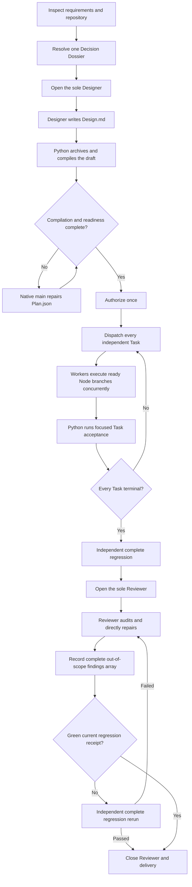

# Better Plan end-to-end workflow

This guide explains the complete Better Plan delivery flow from the first requirement to the final
handoff. It is written for the native main agent that coordinates the workflow and for users who
want to understand which tool runs at each stage, what is passed to each role, and how failures are
closed without adding new roles or approval gates.

The core division of responsibility is simple:

- the user decides outcome-changing choices once;
- the Designer spends expensive model intelligence on the solution design;
- Python compiles and validates deterministic structure;
- Workers implement mutually independent Tasks and parallel Node branches;
- Python runs focused and complete regressions outside role model time; and
- one writable Reviewer audits the integrated source and tests after the complete regression.

`Plan.json` remains the sole semantic source. `Design.md` is an authorization-time design input,
and `Checkpoints.json` stores execution state and evidence.

## Command conventions

Every command below uses `scripts/manifest_tool.py`:

```sh
python3 scripts/manifest_tool.py <command> <root> --plan <plan>
```

- `<root>` is the Better Plan workspace root containing `Manifest.json`.
- `<plan>` is the stable `PLAN-*` code, title, or delivery directory selector.
- Host role dispatch is performed by the native agent tool, not by the Python CLI.
- Whenever a CLI command returns an `assignment`, `brief`, selector, or `dispatch_id`, the native
  main forwards or binds that exact value instead of recreating it from memory.

## Workflow at a glance



The complete regression is an independent delivery stage. It runs before Reviewer dispatch, but it
does not belong to the Reviewer session. Neither `open-reviewer-session` nor
`close-reviewer-session` executes tests.

## 1. Inspect first and create the Plan shell

The native main first inspects the affected repository contracts, tests, schemas, interfaces,
state owners, failure behavior, and delivery tooling. Discoverable facts go into
`ledger.observed`; they are not returned to the user as questions.

When a new Delivery Plan is required, create its bounded intent:

```sh
python3 scripts/manifest_tool.py init-plan <root> \
  --code PLAN-001 \
  --title "Delivery title" \
  --directory delivery \
  --goal "Observable delivery outcome" \
  --scope-in "Authorized capability" \
  --scope-out "Unrelated behavior" \
  --success "Executable success condition" \
  --risk-boundary "Authority or safety boundary"
```

This creates the Plan shell and render-only projection. It does not design Tasks.

## 2. Resolve user decisions once

Only non-discoverable choices that materially change the outcome enter the Decision Dossier. Build
all questions together from one JSON input:

```sh
python3 scripts/manifest_tool.py build-dossier <root> \
  --plan <plan> \
  --input dossier.json
```

Each question must explain its context, the `DEC-*` decisions it resolves, the effects of every
mutually exclusive option, and its recommended and default choices. Present the whole Dossier once,
then apply the user's selections and declared defaults in one operation:

```sh
python3 scripts/manifest_tool.py resolve-dossier <root> \
  --plan <plan> \
  --input selections.json
```

After resolution, the Dossier never reopens. Later implementation decisions follow the authorized
intent and decision precedence instead of interrupting the user.

## 3. Open the sole Designer and pass requirements

Open exactly one Designer session:

```sh
python3 scripts/manifest_tool.py open-designer-session <root> \
  --plan <plan> \
  --native-host codex
```

The command precreates the neutral `Design.md` skeleton and returns:

- `dispatch_id` for exact session correlation;
- the installed Designer selector;
- `plan_path` and canonical `draft_path`;
- `references/designer.md` and the Design format references; and
- an `assignment` that the native main must forward unchanged.

The assignment has this operational meaning:

```text
Write the complete solution design to the returned draft_path before returning.
Group dependent work inside one Task so every Task is mutually parallel-safe.
Inside each Task, design a minimal Node DAG: branch independent Nodes, declare only real
dependencies, and list every predecessor at joins. Mark each Task's relative Workload as light,
medium, or heavy without estimating clock time. Do not edit Plan.json.spec while the draft path is
available. Use the direct-write path only when the host cannot create the draft.
```

The native main passes the confirmed goal, scope, success conditions, risk boundary, requirements,
resolved decisions, repository facts, returned assignment, and knowledge references. It does not
pre-design the Task graph. The Designer decides architecture, tradeoffs, risks, Task boundaries,
Node dependencies, and acceptance semantics without authoring canonical codes or strict JSON
bookkeeping.

After host dispatch, bind the returned agent id:

```sh
python3 scripts/manifest_tool.py bind-agent <plan> <root> \
  --plan <plan> \
  --dispatch-id <dispatch-id> \
  --agent-id <designer-agent-id>
```

When the Designer reaches its final boundary, record the exact callback:

```sh
python3 scripts/manifest_tool.py agent-complete <root> \
  --plan <plan> \
  --agent-id <designer-agent-id> \
  --final
```

## 4. Close the Designer and compile the draft

Close the same session:

```sh
python3 scripts/manifest_tool.py close-designer-session <root> \
  --plan <plan> \
  --dispatch-id <dispatch-id>
```

If the Designer wrote `Design.md`, Python automatically:

1. restores any immutable intent or decision fields the Designer touched;
2. archives the exact draft as `Design.pristine.md`;
3. compiles the draft into `Plan.json.spec`;
4. generates canonical `REQ-*`, `TASK-*`, `NODE-*`, `OUT-*`, and `AC-*` codes;
5. fills schema defaults, mappings, references, inputs, and acceptance coverage; and
6. records precise structure, content, and unmapped diagnostics.

After return, `Design.md` is read-only. It must never be edited or shortened to make a diagnostic
disappear.

If no draft was produced, the existing direct-write mode remains valid. That is the second mode; it
is not a second authoritative path when a real draft exists.

The Designer may optionally preview compilation while still working:

```sh
python3 scripts/manifest_tool.py compile-design <root> --plan <plan> --check
```

Every compiler problem identifies its exact Design line and canonical Plan field. The compiler does
the localization once so no agent spends model time rediscovering it.

## 5. Repair conversion issues in the native main

Ask for the canonical next action:

```sh
python3 scripts/manifest_tool.py next-action <root> --plan <plan>
```

When compilation has open issues, the result is `repair_plan` with a self-contained brief:

- `plan_path` identifies the writable semantic source;
- `readonly_design_path` identifies the immutable Designer draft;
- `issues` contains exact line, field, kind, message, and status; and
- `rules_reference` points to `references/structure-repair.md`.

The native main repairs `Plan.json`, not `Design.md`. Its operating prompt is:

```text
Use the supplied line-and-field diagnostics directly. Keep Design.md and Design.pristine.md
unchanged. Complete Plan.json so every mapped and unmapped Designer meaning is represented without
freely rewriting the Designer's semantic prose. Do not redispatch the Designer.
```

Apply the repair receipt only after the Plan is complete:

```sh
python3 scripts/manifest_tool.py compile-design <root> --plan <plan> --apply
```

`--apply` validates the repaired Plan and closes resolved diagnostics. It never recompiles the draft
or overwrites the native main's repair.

## 6. Check readiness and authorize once

List every remaining gap in one pass:

```sh
python3 scripts/manifest_tool.py check-readiness <root> --plan <plan>
```

Readiness proves that decisions are closed, Tasks are mutually independent, ownership does not
overlap, Node DAGs are valid, acceptance covers every requirement and output, and focused and
complete regression contracts are executable.

After the user or inherited host Plan authorizes the exact semantic Plan, seal it once:

```sh
python3 scripts/manifest_tool.py authorize-plan <root> \
  --plan <plan> \
  --source explicit \
  --reference "approval reference"
```

Authorization records the semantic digest and creates `Checkpoints.json`. No Worker starts before
this gate, and no ordinary implementation question returns to the user afterward.

## 7. Dispatch the full parallel Task frontier

Call `next-action`. After authorization it returns the full eligible Task frontier. Every Task is
independently acceptable and mutually parallel-safe, so the native main dispatches all eligible
Tasks concurrently:

```sh
python3 scripts/manifest_tool.py dispatch-task TASK-001 <root> \
  --plan <plan> \
  --native-host codex
```

Run the command once per eligible Task. Each result contains the exact Worker tier, `dispatch_id`,
the selected `agent_type`, a byte-stable Worker `assignment`, and a compiled brief with the
authorized scope, relevant decisions, complete Task contract, Node DAG, and execution policy. A
Task marked `worker: frontend` first checks Codex's optional local `frontend-worker`; when that valid
configuration exists it must be dispatched, and only its absence falls back to the Task's
standard/complex tier.

The Worker receives this operating prompt with the returned brief:

```text
Implement this one independently acceptable Task. Do not ask the user questions after
authorization. Execute every currently ready Task Node concurrently; wait only at declared joins,
and never serialize independent Nodes for convenience. Stay inside the Task's ownership and return
changed repository-relative paths plus focused evidence.
```

For all eligible Tasks with the same returned `agent_type`, forward the returned `assignment`
byte-for-byte as the common prompt prefix and append each Task's own brief. The stable prefix is
intentional: it improves prompt-cache hits and Token efficiency. Dispatch every Task separately and
concurrently; prompt reuse never authorizes sharing one live agent ID or combining Task contracts.

Bind each Worker agent id to exactly one dispatch using `bind-agent`. A spawn result is not a
completion signal. Record a Worker only when its exact final callback arrives:

For Codex, spawn every configured role with `fork_turns` set to `none`; a full-history fork inherits
the parent role and is incompatible with `agent_type`. Use a unique lower-snake `task_name` for each
attempt, dispatch no more children than the currently available collaboration slots, and never
substitute a generic `worker` for either Better Plan Worker tier.

Pass the canonical task name returned by Codex spawn, such as `/root/backend_worker`, unchanged to
both `bind-agent` and `agent-complete`. Better Plan recognizes that narrow form as a host identity;
do not replace `/` with punctuation, use the UI thread UUID, or invent a second correlation id.
Codex completion is parent-driven: wait for that task's exact final callback and then invoke
`agent-complete`. Do not install or rely on a Codex completion Hook because its subagent-stop UUID
cannot be correlated safely with the returned canonical task name.

```sh
python3 scripts/manifest_tool.py agent-complete <root> \
  --plan <plan> \
  --agent-id <worker-agent-id> \
  --final
```

Silence, elapsed time, and context compaction are not failures. Use `delegation-failed` only for a
conclusive host refusal, unavailability, terminal failure, or confirmed termination. At the retry
ceiling, `main-complete` completes the same role contract in the native main; it does not create a
new role.

## 8. Run focused acceptance concurrently

After a Worker returns, Python runs that Task's declared focused acceptance:

```sh
python3 scripts/manifest_tool.py accept-task TASK-001 <root> --plan <plan>
```

Invoke `accept-task` concurrently for every independent Task awaiting acceptance. Each Task keeps
the declared order of its own commands, while separate Tasks may verify in parallel. Long-running
commands execute outside the global workspace lock; only the state snapshot and result commit are
serialized.

If acceptance passes, the Task becomes `completed`. If it fails, the Task enters
`worker_correction`. The native main either repairs it directly and reruns `accept-task`, or calls
`dispatch-task` again for one correction Worker. There is no separate Repair Task.

If an action truly needs new scope, credentials, irreversible authority, or unavailable external
infrastructure, mark only that Task:

```sh
python3 scripts/manifest_tool.py block-task TASK-001 <root> \
  --plan <plan> \
  --kind authority \
  --reason "Safe public blocker summary"
```

Independent Tasks continue.

## 9. Revise unstarted work when implementation reveals a Plan defect

When an in-scope discovery changes unstarted work, open a continuation instead of asking the user or
dispatching another Designer:

```sh
python3 scripts/manifest_tool.py begin-continuation <root> \
  --plan <plan> \
  --reason "Safe in-scope reason"
```

Revise only unstarted work, then reseal the same authorization boundary:

```sh
python3 scripts/manifest_tool.py close-continuation <root> \
  --plan <plan> \
  --continuation-id <continuation-id>
```

Started Task contracts and evidence remain frozen. A continuation cannot expand the goal, scope,
user decisions, elevated risk, or irreversible authority.

## 10. Run the independent complete regression

When every Task reaches a completed or hard-blocked terminal and no continuation is open,
`next-action` returns:

```json
{"action":"run_full_regression"}
```

Run the independent stage:

```sh
python3 scripts/manifest_tool.py run-full-regression <root> --plan <plan>
```

This command:

- snapshots the authorized Plan and Checkpoints under the lock;
- releases the lock and runs the complete regression;
- records only command digests, outcomes, exit codes, timestamps, and the covered-path fingerprint;
- stores that receipt in `Checkpoints.json.full_regression`; and
- returns bounded privacy-safe failure diagnostics ephemerally to the native main.

Raw command output, local paths, runtime endpoints, and secrets are never persisted. The returned
`action` is `open_reviewer_session` for the initial run.

This is a delivery verification stage, not a Reviewer stage. It consumes no Reviewer model time.

## 11. Open and dispatch the sole Reviewer

After the independent regression has completed, call:

```sh
python3 scripts/manifest_tool.py open-reviewer-session <root> \
  --plan <plan> \
  --native-host codex
```

`open-reviewer-session` does not run tests. It only verifies that the regression receipt exists,
matches the declared command contract, and still fingerprints the current covered paths. It then
creates the sole Reviewer session and returns the selector, `dispatch_id`, role reference, and
compiled audit brief.

The native main attaches the ephemeral diagnostics returned by the immediately preceding
`run-full-regression` call and dispatches this prompt:

```text
You are this Plan's sole writable Reviewer. The independent complete-regression stage has already
finished; do not run or wait for it. Audit the current source, tests, authorized Plan, Task evidence,
regression receipt, and supplied diagnostics. Directly repair every in-scope defect instead of only
recommending a patch; Task ownership does not limit repairs inside the authorized Plan. Leave a
confirmed defect outside that Plan untouched and return it in the complete structured
out_of_scope_findings array, using an empty array when there are none. Do not create its repair Plan.
Use bounded focused checks only when they materially guide a repair. If later independent
verification fails, resume this same session; do not create a Repair Task or a second Reviewer.
```

For visual or hybrid Tasks, the Reviewer also exercises the real rendered interface with browser
and vision and obtains rendered evidence.

Bind and complete the Reviewer through the same exact correlation tools:

```sh
python3 scripts/manifest_tool.py bind-agent <plan> <root> \
  --plan <plan> \
  --dispatch-id <dispatch-id> \
  --agent-id <reviewer-agent-id>

python3 scripts/manifest_tool.py agent-complete <root> \
  --plan <plan> \
  --agent-id <reviewer-agent-id> \
  --final
```

The Reviewer returns the complete `out_of_scope_findings` array defined in
`references/reviewer.md`. Persist that exact privacy-safe array, including `[]`, before choosing the
next action:

```sh
python3 scripts/manifest_tool.py record-reviewer-findings <root> \
  --plan <plan> \
  --dispatch-id <dispatch-id> \
  --input -
```

Pass the JSON array through standard input so no temporary workspace artifact enters a covered
path. This records findings only. It does not edit their implementation, create a Plan, authorize
work, or invalidate a current regression receipt.

## 12. Verify Reviewer repairs and close

After the Reviewer returns, `next-action` first returns `record_reviewer_findings` until the command
above records that return. Then call `next-action` again.

If the prior regression passed and the Reviewer did not change any covered path, the existing green
receipt is current and the action is `close_reviewer_session`.

If the prior run failed or Reviewer repairs changed covered paths, the action is
`run_full_regression`. Run the same independent stage again. The Reviewer does not supervise or wait
for it.

If the rerun passes, close the session. If it fails, the command returns `resume_reviewer` with new
ephemeral diagnostics. Send them to the already bound Reviewer agent with this follow-up:

```text
Resume the current Reviewer session. The independent complete regression still fails. Directly
repair the supplied diagnostics, run only bounded focused checks, and return. Do not run or wait for
the complete regression. Return the complete out_of_scope_findings array again.
```

Never create another Reviewer. Record the complete findings array after every resumed return, then
repeat the independent verification and same-session repair loop until it is green or the Reviewer
proves a hard authority or environment blocker.

Close a green delivery:

```sh
python3 scripts/manifest_tool.py close-reviewer-session <root> \
  --plan <plan> \
  --dispatch-id <dispatch-id>
```

`close-reviewer-session` executes no tests. It closes only against current green independent
regression evidence, marks the Reviewer `completed`, marks Checkpoints `completed`, and moves the
Plan to `completed`. Only after checking that green covered-path fingerprint, it creates one
separate unapproved `draft` Plan per recorded out-of-scope finding and returns those Plans in
`followup_plans`; `user_handoff_required` is then true. Production code must not change afterward,
and no follow-up starts without its own authorization.

For a proven hard blocker, close with a privacy-safe public summary:

```sh
python3 scripts/manifest_tool.py close-reviewer-session <root> \
  --plan <plan> \
  --dispatch-id <dispatch-id> \
  --blocked-reason "Safe public blocker summary"
```

The Plan then ends in `blocked` rather than pretending delivery succeeded. Recorded unrelated
findings still become separate unapproved draft repair Plans.

## 13. Final handoff

The native main may inspect canonical truth without mutating it:

```sh
python3 scripts/manifest_tool.py validate <root>
python3 scripts/manifest_tool.py status <root> --json
python3 scripts/manifest_tool.py tree <root> --plan <plan> --details
```

The final user report summarizes the delivered outcome, completed or blocked Tasks, complete
regression result, Reviewer repairs, rendered evidence when applicable, and any hard blocker. It
also lists every `followup_plans` entry as a confirmed pending defect with its impact and states that
the draft repair Plan remains unapproved. It does not dispatch another role, execute a follow-up,
rerun a green complete regression, or introduce a new approval.

## Recovery and fail-closed rules

- Use `next-action` whenever the current stage is unclear; it names one canonical next step.
- One host agent id owns exactly one active dispatch. Ambiguous callbacks advance nothing.
- One Designer and one Reviewer are lifetime limits, not retry counters. Delegation fallback
  completes the existing session.
- `Design.md` and `Design.pristine.md` preserve the expensive Designer output; conversion repair
  changes `Plan.json` only.
- Diagnostics identify exact source locations and are handed directly to the responsible agent.
  Raw runtime output is not persisted.
- Unknown structure, stale evidence, overlapping ownership, unsupported generations, and expanded
  authority fail closed instead of being guessed or silently repaired.
- Parallel work stays parallel: independent Tasks, ready Node branches, and focused acceptance for
  independent Tasks are never serialized merely for convenience.
