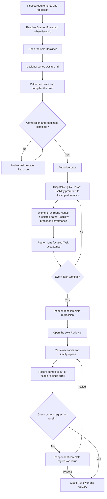

# Better Plan end-to-end workflow

This guide explains the complete Better Plan delivery flow from the first requirement to the final
handoff. It is written for the native main agent that coordinates the workflow and for users who
want to understand which tool runs at each stage, what is passed to each role, and how failures are
resolved within existing authorization while preserving explicit approval requirements.

The core division of responsibility is simple:

- the user resolves material undiscoverable choices together, only when any remain;
- the Designer spends expensive model intelligence on the solution design;
- Python compiles and validates deterministic structure;
- Workers implement mutually independent Tasks and parallel Node branches;
- Python runs focused and complete regressions outside role model time; and
- one writable Reviewer audits the integrated source and tests after the complete regression.

`Plan.json` remains the sole semantic source. `Design.md` is an authorization-time design input,
and `Checkpoints.json` stores execution state and evidence.

## Command conventions

Every command below uses `scripts/manifest_tool.py`:

```sh
python3 scripts/manifest_tool.py <command> <root> --plan <plan>
```

- `<root>` is the Better Plan workspace root containing `Manifest.json`.
- `<plan>` is the stable `PLAN-*` code, title, or delivery directory selector.
- Host role dispatch is performed by the native agent tool, not by the Python CLI.
- Whenever a CLI command returns an `assignment`, `brief`, `role_reference`, selector, or `dispatch_id`, the native
  main forwards or binds that exact value instead of recreating it from memory.
- Each role reads its returned reference from the installed skill. Do not append this walkthrough,
  other role guides, or paraphrased policy to a compiled brief. Consult only the current stage here.
- Brief record paths are relative to `<root>`; include its repository-relative location in the
  dispatch so roles can read original records on demand.

## Workflow at a glance



The complete regression is an independent delivery stage. It runs before Reviewer dispatch, but it
does not belong to the Reviewer session. Neither `open-reviewer-session` nor
`close-reviewer-session` executes tests.

## 1. Inspect first and create the Plan shell

### Functional usability is a prerequisite, not a performance result

For application/service performance work, use this order:

```text
Functional implementation and focused correctness checks
  -> actual backend + actual frontend (where delivered) + integrated user/protocol path
  -> current candidate-bound passing usability evidence
  -> benchmark implementation/validation, load experiments and performance optimization
  -> declared final regression and independent review
```

The prerequisite must exercise actual supported entry points. Backend startup/health alone is not
enough: perform a representative authorized operation. For a frontend product, open the real UI in
a browser, verify its rendering, and complete an action against the same backend. Check the required
protocol path and returned effect/result, then normal shutdown. External services may be controlled
fixtures; the product itself must not be replaced by a Mock or a benchmark-only kernel.

Record the candidate, relevant runtime/configuration, checks, expected/observed results and safe
evidence links in the existing verification records. Use explicit passed, failed, not_run or blocked
states. Builds, typechecks, package/image assembly, isolated tests or another candidate's receipt do
not open the performance stage. Relevant changes require fresh affected functional evidence, not
another whole-project regression. A frontend cannot be omitted merely because the proposed load
client talks HTTP or MCP directly.

Before dispatching, the native main checks this semantic prerequisite in addition to CLI structural
eligibility. Keep required ordering inside a Task's Node DAG; when a separate performance Plan
depends on another delivery, do not dispatch it until the actual readiness evidence exists. A
separate tool repository, fixture label or passing tool self-test does not bypass the ordering.
For an already-started Plan missing this requirement, pause dependent work and record the missing
functional prerequisite with `record-task-input --needed`; do not resolve it on a promise or rewrite
sealed history. Continue only authorized functional diagnosis/repair, not more performance work.
This is a native execution rule using existing records, not a claim that the Python CLI automatically
probes a running product or that a new gate service has been installed.

Create the workspace in the main repository, never inside a linked Git worktree. A worktree is a
second checkout of the same repository, so a workspace there documents one delivery as two sealed
revisions that cannot be reconciled afterwards. `init-plan` detects the `gitdir:` pointer in a
worktree's `.git` file and refuses that location; the supported alternatives are to create the
workspace in the main repository and point `Manifest.json` `project_root` at the delivery directory.
`--worktree-workspace` accepts the split only when it is deliberate.

The native main first inspects the affected repository contracts, tests, schemas, interfaces,
state owners, failure behavior, and delivery tooling. Discoverable facts go into
`ledger.observed`; they are not returned to the user as questions.

When a new Delivery Plan is required, create its bounded intent:

```sh
python3 scripts/manifest_tool.py init-plan <root> \
  --code PLAN-001 \
  --title "Delivery title" \
  --directory delivery \
  --goal "Observable delivery outcome" \
  --scope-in "Authorized capability" \
  --scope-out "Unrelated behavior" \
  --success "Executable success condition" \
  --risk-boundary "Authority or safety boundary"
```

This creates the Plan shell and render-only projection. It does not design Tasks.

## 2. Resolve user decisions once

Only non-discoverable choices that materially change the outcome enter the Decision Dossier. Build
all questions together from one JSON input. If there are none, retain `not_required`, skip both
Dossier commands, and open the Designer without asking the user to confirm that omission:

```sh
python3 scripts/manifest_tool.py build-dossier <root> \
  --plan <plan> \
  --input dossier.json
```

Each question must explain its context, the `DEC-*` decisions it resolves, the effects of every
mutually exclusive option, and its recommended and default choices. Present the whole Dossier once,
then apply the user's selections and declared defaults in one operation:

```sh
python3 scripts/manifest_tool.py resolve-dossier <root> \
  --plan <plan> \
  --input selections.json
```

After resolution, the Dossier never reopens. Later implementation decisions follow the authorized
intent and decision precedence; only genuinely missing input or authority needs a user response.
Defaults apply only to ordinary
preferences; neither an omission nor a declared default grants authority for a reserved action.

## 3. Open the sole Designer and pass requirements

Open exactly one Designer session:

In all three role-dispatch commands below, use `--native-host codex` on Codex or
`--native-host kilo` on Kilo; forward the returned `agent_type` unchanged to the native spawn.

```sh
python3 scripts/manifest_tool.py open-designer-session <root> \
  --plan <plan> \
  --native-host <native-host>
```

The command precreates the neutral `Design.md` skeleton and returns:

- `dispatch_id` for exact session correlation;
- the installed Designer selector;
- `plan_path` and canonical `draft_path`;
- `references/designer.md` and the Design format references; and
- an `assignment` that the native main must forward unchanged.

The native main passes the confirmed goal, scope, success conditions, risk boundary, requirements,
resolved decisions, repository facts, returned assignment, and knowledge references. It does not
pre-design the Task graph. The Designer decides architecture, tradeoffs, risks, Task boundaries,
Node dependencies, and acceptance semantics without authoring canonical codes or strict JSON
bookkeeping. Its complete operating contract is in `references/designer.md`; forward the returned
assignment unchanged instead of composing another instruction block.

After host dispatch, bind the returned agent id:

```sh
python3 scripts/manifest_tool.py bind-agent <plan> <root> \
  --plan <plan> \
  --dispatch-id <dispatch-id> \
  --agent-id <designer-agent-id>
```

When the Designer reaches its final boundary, record the exact callback:

```sh
python3 scripts/manifest_tool.py agent-complete <root> \
  --plan <plan> \
  --agent-id <designer-agent-id> \
  --final
```

## 4. Close the Designer and compile the draft

Close the same session:

```sh
python3 scripts/manifest_tool.py close-designer-session <root> \
  --plan <plan> \
  --dispatch-id <dispatch-id>
```

If the Designer wrote `Design.md`, Python automatically:

1. restores any immutable intent or decision fields the Designer touched;
2. archives the exact draft as `Design.pristine.md`;
3. compiles the draft into `Plan.json.spec`;
4. generates canonical `REQ-*`, `TASK-*`, `NODE-*`, `OUT-*`, and `AC-*` codes;
5. fills schema defaults, mappings, references, inputs, and acceptance coverage; and
6. records precise structure, content, and unmapped diagnostics.

After return, `Design.md` is read-only. It must never be edited or shortened to make a diagnostic
disappear.

If no draft was produced, the existing direct-write mode remains valid. That is the second mode; it
is not a second authoritative path when a real draft exists.

The Designer may optionally preview compilation while still working:

```sh
python3 scripts/manifest_tool.py compile-design <root> --plan <plan> --check
```

Every compiler problem identifies its exact Design line and canonical Plan field. The compiler does
the localization once so no agent spends model time rediscovering it.

## 5. Repair conversion issues in the native main

Ask for the canonical next action:

```sh
python3 scripts/manifest_tool.py next-action <root> --plan <plan>
```

When compilation has open issues, the result is `repair_plan` with a self-contained brief:

- `plan_path` identifies the writable semantic source;
- `readonly_design_path` identifies the immutable Designer draft;
- `issues` contains exact line, field, kind, message, and status; and
- `rules_reference` points to `references/structure-repair.md`.

The native main repairs `Plan.json`, not `Design.md`. Its operating prompt is:

```text
Use the supplied line-and-field diagnostics directly. Keep Design.md and Design.pristine.md
unchanged. Map every valid in-scope Designer meaning into Plan.json without freely rewriting valid
design choices. Do not promote content conflicting with explicit user decisions, out-of-scope
suggestions, or rejected alternatives into implementation requirements. Record each non-adoption
reason in the Plan's architecture notes with its Design line reference. Do not redispatch the Designer.
```

Apply the repair receipt only after the Plan is complete:

```sh
python3 scripts/manifest_tool.py compile-design <root> --plan <plan> --apply
```

`--apply` validates the repaired Plan and closes resolved diagnostics. It never recompiles the draft
or overwrites the native main's repair.

## 6. Check readiness and authorize once

List every remaining gap in one pass:

```sh
python3 scripts/manifest_tool.py check-readiness <root> --plan <plan>
```

Structural readiness proves that decisions are closed, Tasks are mutually independent, ownership does not
overlap, Node DAGs are valid, acceptance covers every requirement and output, and focused and
complete regression contracts are executable.
It does not prove frontend/backend usability; performance work also requires the current functional
evidence described above. Authorization cannot substitute for that evidence.

After the user authorizes the exact semantic Plan, seal it once:

```sh
python3 scripts/manifest_tool.py authorize-plan <root> \
  --plan <plan> \
  --source explicit \
  --reference "approval reference"
```

Authorization records the semantic digest and creates `Checkpoints.json`. No Worker starts before
this gate, and no ordinary implementation question returns to the user afterward.

The gate does not necessarily require another user interaction. Use `--source inherited_host_plan`
when the approved host artifact binds this exact semantic Plan. Use
`--source inherited_implementation_request` when an existing explicit request to implement the same
concrete specification covers every choice, scope, risk, and reserved action. Otherwise present the
complete Plan for explicit approval. General requests to investigate or refactor do not approve
unseen design choices. Dossier selections and defaults resolve preferences; they do not replace
the authorization gate. Existing sealed authorization is resumed, never requested again.

## 7. Dispatch the full parallel Task frontier

Call `next-action`. After authorization it returns the full eligible Task frontier. Every Task is
independently acceptable and mutually parallel-safe, so the native main dispatches all eligible
Tasks concurrently:

```sh
python3 scripts/manifest_tool.py dispatch-task TASK-001 <root> \
  --plan <plan> \
  --native-host <native-host>
```

Run the command once per eligible Task. Each result contains the exact Worker role, `dispatch_id`,
the selected `agent_type`, a byte-stable Worker `assignment`, and a compiled brief with the
authorized goal/scope/success/risk boundary, owned requirement definitions, global architecture,
resolved decisions, and complete Task contract including its Node DAG. Decisions remain complete
because v3 has no Task applicability mapping. Original context is available at `plan_path`. A
Task marked `worker: hybrid` dispatches to the host's hybrid role — Codex's packaged
`hybrid-worker`, or Kilo's `better-plan-hybrid-worker` — and on Codex the native main checks that
local role first: a valid configuration must be dispatched, and only its absence falls back to the
`worker` role. No Task is tiered, so a Task the native main judges underpowered is repartitioned by
continuation, never re-dispatched at a stronger role.

Forward `role_reference: references/worker.md` with that brief. It owns the fixed execution, evidence,
and escalation rules; do not copy them into another operating prompt.

For all eligible Tasks with the same returned `agent_type`, forward the returned `assignment`
byte-for-byte as the common prompt prefix and append each Task's own brief. The stable prefix is
intentional: it improves prompt-cache hits and Token efficiency. Dispatch every Task separately and
concurrently; prompt reuse never authorizes sharing one live agent ID or combining Task contracts.

Bind each Worker agent id to exactly one dispatch using `bind-agent`. A spawn result is not a
completion signal. Record a Worker only when its exact final callback arrives:

Use `references/host-configuration.md` for the host's exact spawn, capacity, identity, and completion
rules. Those platform details do not change the Task contract or its independent acceptance.

```sh
python3 scripts/manifest_tool.py agent-complete <root> \
  --plan <plan> \
  --agent-id <worker-agent-id> \
  --final
```

Silence, elapsed time, and context compaction are not failures. Use `delegation-failed` only for a
conclusive host refusal, unavailability, terminal failure, or confirmed termination. At the retry
ceiling, `main-complete` completes the same role contract in the native main; it does not create a
new role.

A Worker may also stop short and return `task-exceeds-session` when the remaining Nodes no longer fit
one session. That is a handoff, not a failure and not a completion: record the final callback, then run
that Task's canonical acceptance exactly as usual instead of skipping it. If acceptance passes, the
Task is complete, because a Task is judged by its oracle rather than by a Node count. If it fails, the
Task enters `worker_correction`, and one correction Worker carries the remaining frontier the Worker
named, under the same frozen contract and the existing retry ceiling. Never accept a Task on partial
work, never widen its oracle, and never answer the handoff by creating a second workspace or Plan for
the remainder.

## 8. Run focused acceptance serially in one build directory

Workers edit source and run only their own bounded focused checks, inside the build, test, and cache
paths their Task declares in `Exclusive`. After a Worker returns, Python runs that Task's declared
canonical focused acceptance:

```sh
python3 scripts/manifest_tool.py accept-task TASK-001 <root> --plan <plan>
```

Run `accept-task` for one returning Task at a time, in the same build directory, and do not start the
next one until it finishes. Build tooling takes an exclusive lock on its own output directory, so
concurrent acceptance does not verify in parallel: it queues, and every Task waits on the lock while
the machine does one Task's work. Serializing here costs nothing that concurrency would have saved
and keeps one warm cache shared by every Task. Long-running commands still execute outside the global
workspace lock; only the state snapshot and result commit are serialized.

If acceptance passes, the Task becomes `completed`. If it fails, the Task enters
`worker_correction`. The native main either repairs it directly and reruns `accept-task`, or calls
`dispatch-task` again for one correction Worker. There is no separate Repair Task.

When required user input or authority is missing, the native main records it before asking:

```sh
python3 scripts/manifest_tool.py record-task-input TASK-001 <root> \
  --plan <plan> --needed "Required test account access must be supplied"
```

This only stores a privacy-safe `input_request`; it sends no message, grants no permission, and
preserves the Task's status, dispatch, and evidence. Report the prerequisite promptly, complete
authorized preparation so the decision is concrete, and request only the missing input or approval.
`next-action` continues independent Tasks and returns `await_user_input` when only the recorded
requests remain. A pending request prevents that Task's dispatch or acceptance and prevents final
verification or closure, including when the Reviewer discovers it after Task acceptance.

After the real answer or prerequisite is verified, record its safe outcome:

```sh
python3 scripts/manifest_tool.py record-task-input TASK-001 <root> \
  --plan <plan> --resolved "Required test account access is now available"
```

Do not record credentials, raw user messages, or private operational details. Resolution removes the
request and appends an evidence item without changing Plan semantics or granting new authority.
Resume the same delivery only within its existing authorization; silence is not resolution.
If the Reviewer session is active, resolution returns `resume_reviewer`. Send the actual resolved
prerequisite to that same Reviewer so it finishes the interrupted audit or repair, then record its
new final callback and complete findings array. Resolving input alone never completes an audit or
requires another complete regression when the green evidence is still current.
Expanded goal, scope, decisions, risk, or irreversible authority requires a separately authorized
Plan. Preserve explicit project approval requirements, including any developer decision required
after a complete-regression failure; ordinary defect reports do not create extra approval gates.

Only when the authorized outcome has a proven hard authority or environment blocker, rather than
an unanswered request, mark the affected Task:

```sh
python3 scripts/manifest_tool.py block-task TASK-001 <root> \
  --plan <plan> \
  --kind authority \
  --reason "Safe public blocker summary"
```

Independent Tasks continue. `block-task` supersedes a pending input request with that final blocker.
During an active Reviewer session it may also supersede a completed Task's recorded input request
with a proven blocker, retaining all historical evidence. A blocked Plan is not a successful delivery.

## 9. Revise in-scope work and correct execution errors

When an in-scope discovery changes unstarted work, or a focused command/path error prevents an
unfinished Task's acceptance, open a continuation instead of asking the user or dispatching another
Designer:

```sh
python3 scripts/manifest_tool.py begin-continuation <root> \
  --plan <plan> \
  --reason "Safe in-scope reason"
```

Revise unstarted work or correct the unfinished Task's execution error, then reseal the same
authorization boundary:

```sh
python3 scripts/manifest_tool.py close-continuation <root> \
  --plan <plan> \
  --continuation-id <continuation-id>
```

For a started but unfinished Task, only `focused_regression.commands` and
`focused_regression.paths` may change, after its Worker's final callback. The native main must
establish that the correction preserves the same oracle, not replace a failing check with a weaker
one. Every other Task field stays frozen, including ownership, guarantees, and acceptance semantics;
completed Task definitions cannot change. The continuation records its reason and the before/after
regression contract, retains historical evidence, and requires fresh focused acceptance. A
continuation cannot expand the goal, scope, user decisions, elevated risk, or irreversible authority.

When the user, not the implementation, supersedes a decision they already made, do not block the
Task and do not open a continuation: a continuation may never alter resolved decisions. Record the
replacement and re-seal it under the user's new explicit reference instead:

```sh
python3 scripts/manifest_tool.py supersede-decision <root> \
  --plan <plan> \
  --decision <DEC-*> \
  --option <option-id-already-offered> \
  --reason "Safe supersession reason" \
  --reference "approval reference"
```

Use it only for a real user change of mind, never to substitute the native main's own preference:
the reference is that user's own turn or approval, and the CLI records the judgment without being
able to prove the consent behind it. The replacement must be an option the Question already offered,
so this changes a choice and never invents one, and it never touches the goal, scope, success
conditions, or risk boundary. The new selection enters the ledger as `user_decided`, which is honest
precisely because the user chose it; the receipt records `from_ledger` and
`authorization_source_before`, so a promoted default or a re-labelled authorization stays visible to
the Reviewer instead of disappearing. Every Task
must still be pending and the Reviewer session must not have opened: a changed decision can
invalidate started work, so a delivery already in flight must finish or be blocked first.
Supersession re-seals the specification that already exists and never recompiles it, so use it only
when the replacement leaves the frozen Tasks, requirements, and acceptance correct. A new choice that
changes the delivery shape needs a separately authorized Plan. The command
appends a `decision_supersession` receipt, increments the revision, and clears the green regression
receipt, which cannot cover changed semantics.

## 10. Run the independent complete regression

When every Task reaches a completed or hard-blocked terminal, no input request remains, and no
continuation is open, `next-action` returns:

```json
{"action":"run_full_regression"}
```

Run the independent stage:

```sh
python3 scripts/manifest_tool.py run-full-regression <root> --plan <plan>
```

This command:

- snapshots the authorized Plan and Checkpoints under the lock;
- releases the lock and runs the complete regression;
- records only command digests, outcomes, exit codes, timestamps, and the covered-path fingerprint;
- stores that receipt in `Checkpoints.json.full_regression`; and
- returns bounded privacy-safe failure diagnostics ephemerally to the native main.

Raw command output, local paths, runtime endpoints, and secrets are never persisted. The returned
`action` is `open_reviewer_session` for the initial run.

This is a delivery verification stage, not a Reviewer stage. It consumes no Reviewer model time.

## 11. Open and dispatch the sole Reviewer

After the independent regression has completed, call:

```sh
python3 scripts/manifest_tool.py open-reviewer-session <root> \
  --plan <plan> \
  --native-host <native-host>
```

`open-reviewer-session` does not run tests. It only verifies that the regression receipt exists,
matches the declared command contract, and still fingerprints the current covered paths. It then
creates the sole Reviewer session and returns the selector, `dispatch_id`, role reference, and
compiled audit brief.

The native main attaches the ephemeral diagnostics returned by the immediately preceding
`run-full-regression` call and forwards `role_reference: references/reviewer.md` with the brief.
That reference owns source/test/design auditing, direct in-scope repairs, rendered evidence, and the
findings return contract. The brief contains the full semantic Plan and Task evidence without
dispatch metadata. Read the regression contract at `plan.spec.full_regression` and the sole receipt
at `full_regression.result`; `checkpoints` does not repeat it. `rendered_evidence_tasks` names the
hybrid Tasks. Use `plan_path` and `checkpoints_path` for complete original records only as
needed; do not resend those records beside their compiled contents.

Bind and complete the Reviewer through the same exact correlation tools:

```sh
python3 scripts/manifest_tool.py bind-agent <plan> <root> \
  --plan <plan> \
  --dispatch-id <dispatch-id> \
  --agent-id <reviewer-agent-id>

python3 scripts/manifest_tool.py agent-complete <root> \
  --plan <plan> \
  --agent-id <reviewer-agent-id> \
  --final
```

The Reviewer returns the complete `out_of_scope_findings` array defined in
`references/reviewer.md`. Persist that exact privacy-safe array, including `[]`, before choosing the
next action:

```sh
python3 scripts/manifest_tool.py record-reviewer-findings <root> \
  --plan <plan> \
  --dispatch-id <dispatch-id> \
  --input -
```

Pass the JSON array through standard input so no temporary workspace artifact enters a covered
path. This records findings only. It does not edit their implementation, create a Plan, authorize
work, or invalidate a current regression receipt.

## 12. Verify Reviewer repairs and close

After the Reviewer returns, `next-action` first returns `record_reviewer_findings` until the command
above records that return. Then call `next-action` again.

If the prior regression passed and the Reviewer did not change any covered path, the existing green
receipt is current and the action is `close_reviewer_session`.

If the prior run failed or Reviewer repairs changed covered paths, the action is
`run_full_regression`. Run the same independent stage again. The Reviewer does not supervise or wait
for it. If project rules explicitly reserve a failed complete regression for a developer decision,
record the needed input and obtain that decision before dependent repairs or reruns.

If the rerun passes, close the session. If it fails, the command returns `resume_reviewer` with new
ephemeral diagnostics. Send the new diagnostics and regression receipt, plus any resolved prerequisite,
to the already bound Reviewer, subject to required developer decisions. Its existing role contract
continues to apply; do not resend the unchanged Plan or role guide.

Never create another Reviewer. Record the complete findings array after every resumed return, then
repeat the independent verification and same-session repair loop until it is green or the Reviewer
proves a hard authority or environment blocker.

Close a green delivery:

```sh
python3 scripts/manifest_tool.py close-reviewer-session <root> \
  --plan <plan> \
  --dispatch-id <dispatch-id>
```

`close-reviewer-session` executes no tests. It closes only against current green independent
regression evidence, marks the Reviewer `completed`, marks Checkpoints `completed`, and moves the
Plan to `completed`. Only after checking that green covered-path fingerprint, it creates one
separate unapproved `draft` Plan per recorded out-of-scope finding and returns those Plans in
`followup_plans`; `user_handoff_required` is then true. Production code must not change afterward,
and no follow-up starts without its own authorization. The successful close also returns a
`version_control_handoff`; this is an instruction for the native main, not an automatic Git side
effect and not Reviewer work. If the project is a Git repository, the native main inspects the
final worktree, preserves unrelated changes, and creates exactly one commit for the completed Plan
on the current branch using the repository's normal Git conventions. It skips this step outside a
Git repository. Creating the commit must not edit production files.

For a proven hard blocker, close with a privacy-safe public summary:

```sh
python3 scripts/manifest_tool.py close-reviewer-session <root> \
  --plan <plan> \
  --dispatch-id <dispatch-id> \
  --blocked-reason "Safe public blocker summary"
```

The Plan then ends in `blocked` rather than pretending delivery succeeded. Recorded unrelated
findings still become separate unapproved draft repair Plans.

## 13. Final handoff

The native main may inspect canonical truth without mutating it:

```sh
python3 scripts/manifest_tool.py validate <root>
python3 scripts/manifest_tool.py status <root> --json
python3 scripts/manifest_tool.py tree <root> --plan <plan> --details
```

The final user report summarizes the delivered outcome, completed or blocked Tasks, complete
regression result, Reviewer repairs, rendered evidence when applicable, and any hard blocker. It
also lists every `followup_plans` entry as a confirmed pending defect with its impact and states that
the draft repair Plan remains unapproved. For a completed delivery it also reports whether the
native main created the one-Plan Git commit or skipped it because the project is not a Git
repository. It does not dispatch another role, execute a follow-up, rerun a green complete
regression, or introduce a new approval.

## Recovery and fail-closed rules

- Use `next-action` whenever the current stage is unclear; it names one canonical next step.
- One host agent id owns exactly one active dispatch. Ambiguous callbacks advance nothing.
- One Designer and one Reviewer are lifetime limits, not retry counters. Delegation fallback
  completes the existing session.
- `Design.md` and `Design.pristine.md` preserve the expensive Designer output; conversion repair
  changes `Plan.json` only.
- Diagnostics identify exact source locations and are handed directly to the responsible agent.
  Raw runtime output is not persisted.
- Unknown structure, stale evidence, overlapping ownership, unsupported generations, and expanded
  authority reject the attempted state transition. Use the existing conversion repair, permitted
  continuation, or verification path when current authority and repository facts justify it, then
  retry. Rejecting a transition does not itself require user approval or stop independent work.
  Never guess callback identity, fabricate evidence, translate unsupported generations, or broaden
  authority. `next-action` names workflow work; it never overrides a pending input or explicit approval.
- Parallel work stays parallel: independent Tasks and ready Node branches are never serialized
  merely for convenience. Focused acceptance is the deliberate exception — see section 8 — because
  build tooling serializes itself on its output directory anyway.
